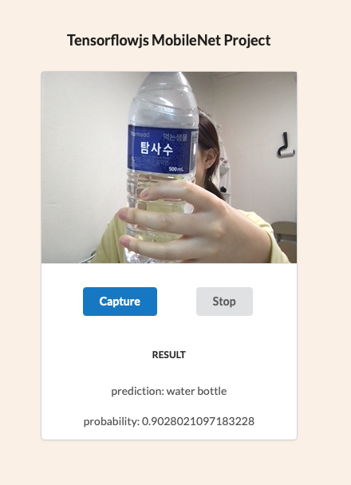

# Tensorflow.js(mobilenet) 를 이용하여 Webcam으로 Image Classifer App 만들기

MobileNet v1의 Javascript api를 이용해 브라우저용 이미지 분류기 앱

###

Heroku를 통한 App 배포
https://radiant-caverns-50899.herokuapp.com

### App 이미지

### 파일 구조

.
├── README.md
├── composer.json
├── index.css
├── index.html
└── index.php
